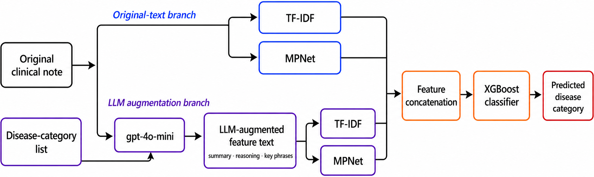
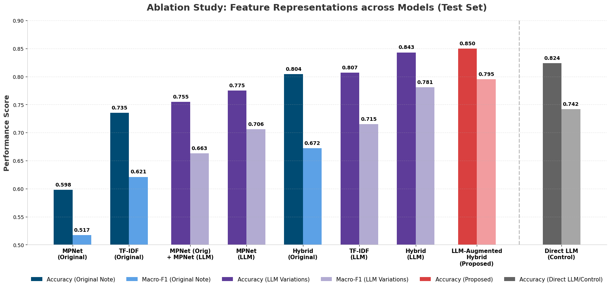

# LLM-Augmented Hybrid Representations for Disease Category Classification from Clinical Notes

Official research-code release for our MAPR 2026 paper:

**Khanh-Thao Le-Vu and Hung-Nghiep Tran. “LLM-Augmented Hybrid Representations for Disease Category Classification from Clinical Notes.”**

Clinical notes contain useful diagnostic evidence, but that evidence is mixed with long and heterogeneous documentation. Our central idea is to use an LLM as a clinical text processor: it produces clinically focused feature text, which is encoded and combined with representations of the original note before lightweight XGBoost classification.

> Use the LLM to improve what the classifier can see—not only to make the final prediction.

## Method



The representation combines four complementary views:

1. TF-IDF features from the original clinical note.
2. MPNet embeddings from the original clinical note.
3. TF-IDF features from LLM-generated feature text.
4. MPNet embeddings from LLM-generated feature text.

The four views are concatenated and classified with XGBoost. The experiments use a fixed train/validation/test split and three experiment seeds: `42`, `123`, and `456`.

## Results



| System | Test accuracy | Test macro-F1 |
|---|---:|---:|
| Original Hybrid | 0.804 ± 0.000 | 0.672 ± 0.000 |
| LLM Hybrid | 0.843 ± 0.017 | 0.781 ± 0.048 |
| Direct LLM Classifier | 0.824 ± 0.000 | 0.742 ± 0.003 |
| **LLM-Augmented Hybrid** | **0.850 ± 0.006** | **0.795 ± 0.020** |

The results support three task-specific observations:

- LLM-generated feature text provides a strong additional representation signal.
- Sparse lexical and dense semantic representations are complementary.
- Combining original-note and LLM-derived representations performs best in this experimental setting.

These findings are not a universal claim that XGBoost outperforms LLMs. They compare particular representation strategies on a small, closed-set disease-category classification task. Machine-readable aggregate results for all evaluated systems are available in [`results/aggregate_metrics.csv`](results/aggregate_metrics.csv).

## Repository contents

```text
.
├── assets/
│   ├── llm-augmented-hybrid.png
│   └── main-results.png
├── data/
│   └── example_synthetic.json
├── notebooks/
│   ├── 01_xgboost_3seeds.ipynb
│   └── 02_direct_llm_3seeds_test.ipynb
└── results/
    └── aggregate_metrics.csv
```

- `01_xgboost_3seeds.ipynb` evaluates the nine XGBoost representation systems across three seeds.
- `02_direct_llm_3seeds_test.ipynb` evaluates the same-model direct LLM comparator on the test set across three seeds, using the same headline metric convention as the XGBoost experiments.
- The notebooks are standalone and may be run independently.
- Saved execution outputs have intentionally been removed from the public notebooks.

## Data access

The clinical data are **not** distributed in this repository. The experiments use the credentialed [MIMIC-IV-Ext-DiReCT v1.0.0](https://physionet.org/content/mimic-iv-ext-direct/1.0.0/) resource on PhysioNet (DOI: [10.13026/yf96-kc87](https://doi.org/10.13026/yf96-kc87)). Researchers must obtain access from PhysioNet and comply with the applicable training, license, and data-use agreement requirements.

After obtaining the resource, place the archive here:

```text
data/samples.rar
```

The fictional [`data/example_synthetic.json`](data/example_synthetic.json) illustrates only the expected `input1`–`input6` schema. It is not drawn from MIMIC, DiReCT, or any real patient record and is not used in evaluation.

No clinical notes, raw record identifiers, ready-made split CSVs, LLM-generated feature text, caches, or record-level predictions are included in this repository.

## Exact split reconstruction

The reported split contains 308 training, 101 validation, and 102 test samples, with 25, 23, and 23 represented disease categories, respectively.

The original experiment fixed `random_state=42` before evaluation. However, its input rows came from an unsorted Google Colab `os.walk`, whose traversal order is filesystem-dependent. The same random seed can therefore produce different members when the input ordering changes.

Both notebooks address this reproducibility issue by:

1. Scanning the acquired 511 files in canonical lexicographic order.
2. Validating the complete file manifest with SHA-256.
3. Applying a hard-coded 511-index permutation that reconstructs the original Colab traversal.
4. Running the original two-stage stratified split with seed `42`.
5. Verifying the reported split sizes and category counts.

The permutation does not contain clinical text, filenames, subject identifiers, labels, or a directly usable split manifest. It reconstructs the reported split only for authorized users who already possess the matching credentialed dataset version. This corrects filesystem nondeterminism; it is not seed selection.

Generated local split files are written under `data/splits/` and ignored by Git.

## Running the notebooks

1. Clone this repository and acquire `samples.rar` as described above.
2. Open either notebook locally or in Google Colab.
3. If needed, set `LLM_FEATURES_PROJECT_ROOT` to the repository root. The Colab default is `/content/drive/MyDrive/LLM-features-clinical-notes`.
4. Review the data-compliance notice in the notebook.
5. Store `OPENAI_API_KEY` in an environment variable or Colab Secrets. Never paste a key into the notebook.
6. Run the setup and configuration cells, then set `EXTERNAL_LLM_DATA_COMPLIANCE_ACKNOWLEDGED = True` in a new cell only after verifying compliance. Do not modify the public notebook’s safe default.
7. Continue running the notebook from top to bottom.

The XGBoost notebook may issue up to 1,533 LLM feature-generation requests—511 notes across three seeds—when no valid cache exists. The direct-classifier notebook may issue up to 306 requests—102 test notes across three seeds. Review expected API usage and cost before running. Generated caches and result files remain local and are ignored by Git.

The final audit environment used Python 3.12.13, scikit-learn 1.6.1, XGBoost 3.2.0, Transformers 5.0.0, Sentence Transformers 5.4.1, and OpenAI Python 2.32.0. The notebooks install their principal dependencies in Colab and print package versions for audit.

## Responsible use

MIMIC-derived resources must be handled as sensitive data. Review the current PhysioNet [guidelines for MIMIC-derived datasets and models](https://physionet.org/news/post/mimic-derived-datasets-models/) before creating or sharing derived artifacts.

The notebooks can transmit clinical-note text to an external LLM service. PhysioNet’s current [guidance for LLMs and online services](https://physionet.org/news/post/llm-responsible-use/) requires researchers to verify appropriate protections, including applicable zero-data-retention, no-training, and no-human-review conditions. Researchers are responsible for satisfying the PhysioNet agreement and their institutional requirements. If compliance cannot be verified, do not send the data to an external service.

This repository is for research and reproducibility only. It is not a medical device and must not be used for clinical diagnosis, treatment, or patient-care decisions.

## How to cite

If you find this work or code useful, please cite:

Khanh-Thao Le-Vu and Hung-Nghiep Tran. “LLM-Augmented Hybrid Representations for Disease Category Classification from Clinical Notes.” In *Proceedings of the 2026 International Conference on Multimedia Analysis and Pattern Recognition (MAPR)*, 2026.

```bibtex
@inproceedings{levu_llm_augmented_hybrid_2026,
  title     = {LLM-Augmented Hybrid Representations for Disease Category Classification from Clinical Notes},
  author    = {Le-Vu, Khanh-Thao and Tran, Hung-Nghiep},
  booktitle = {Proceedings of the 2026 International Conference on Multimedia Analysis and Pattern Recognition (MAPR)},
  year      = {2026}
}
```

## Acknowledgements

This work uses a preprocessed subset from MIMIC-IV-Ext-DiReCT, derived from MIMIC-IV clinical notes. We thank the MIMIC, PhysioNet, and DiReCT teams and the patients whose de-identified data support research.

The original DiReCT implementation is available at [wbw520/DiReCT](https://github.com/wbw520/DiReCT).

## License

The released code and documentation are available under the [MIT License](LICENSE). This license does not grant rights to MIMIC-IV, MIMIC-IV-Ext-DiReCT, or other third-party data and resources.
